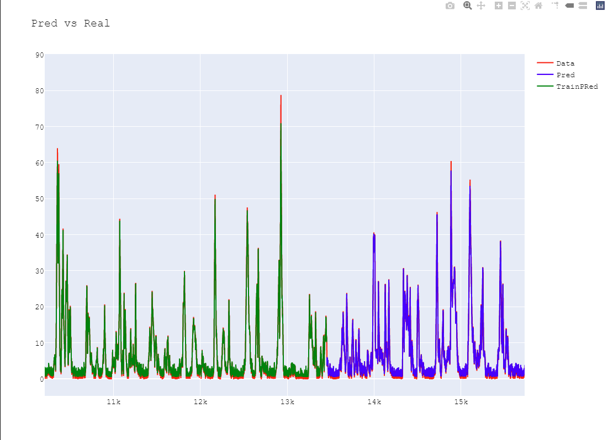

# ClimateAI_Challenge

# Introduction 
in this Repo is all the jupyter notebooks and a little project to visualize the data , is a little project using django to display the predicted data from the selected date 

# Jupyter
There are several Jupyter files most of them are just the proces i followed in order to get the final result 

 1. **Test.ipynb** : this is the fist notebooke I started with , in here I manage to get all the data an get all in one DataFrame in order to make things easier to work with , then I tried to make the predictions using a  **Multiple linear regression**   but the results where not great , while the model can somewhat follow the data it just cant predict spikes and is not accurate at all. I also tried to change the data , using the date in ordinal form with little to no improvement and then i thought of getting rid of the days and years and see the data only by months grouping them into months an create the model based on that , but had no luck either 
 

 2. **Test2.ipynb**: this for the most part is the same as the one above the only difference is that i used a method that can select the best variables to discard  instead of taking them and start guessing which one is the best , at the end results where almost the same so I discarded this option entirely 
 
 3. **Auto.ipynb**:here I thought on the last notebook and started working on a way to select variable at random without me needing to spend time selecting one by one , so I worked on the script to run the model and now each time the model finished I compared the r2_score and if it was not great the model started running again and now with a random selection of variables , dates. At the end this ran for a while but never got any promising results , then in the same notebook i thought since I'm already working without knowing which variables I'm selecting and what are they doing  y decided to give a shot to a neural network  while the network give good results it was not possible to get data for the next day  
  
 4. **keras.ipynb**: this is the second to last Notebook in here I manage to get the NN to work with the prediction of the next day all i needed was a way to visualize the data and to save the model 
  
 5. **kerasTest.ipynb**:Here I only load the dataset and the model saved on the last notebook , and create a plot to see what the model is predicting vs what the real data is 
  

  

## Django Web
In order to make things easier to visualize I created a django project , while I tried to make a docker with the django project unfortunately  I ran into some problems with tensorflow and was not able to finish this on time,there is a requirements.txt in the django app folder so It can be use to create a virtual environment and the django runs with no problem that way 

## Demo
All you need to do for this to run is run 

    py manage.py runserver

once the project   is running will see the main page in here there is an option to select the date you whant to get a prediction you will get a table as a response showing the prediction and the real value 

There is also a second tab  named Graphs in here you can see a plot for all the real data from flow vs what the model predicted 

All the data is stored in   Django db.sqlite3 

